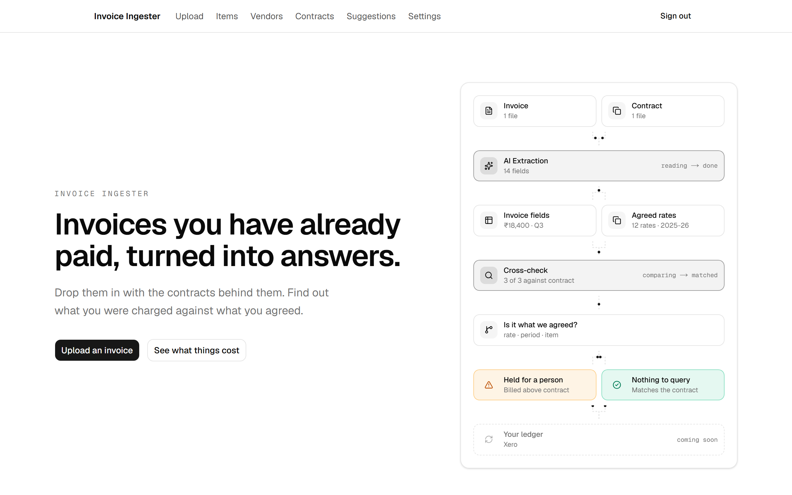
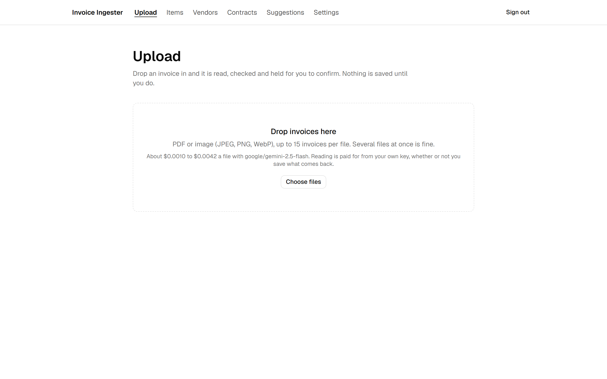
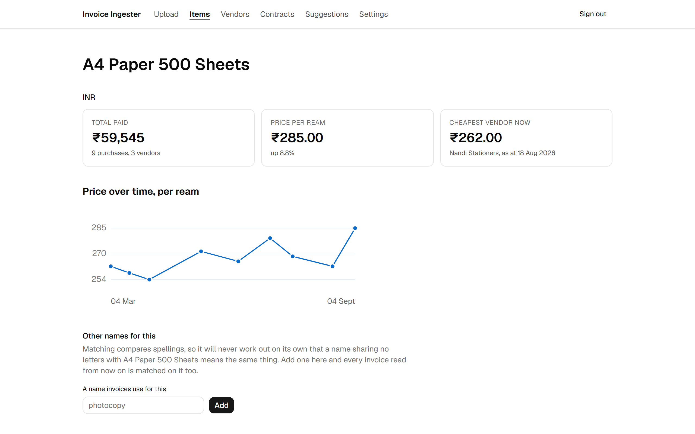
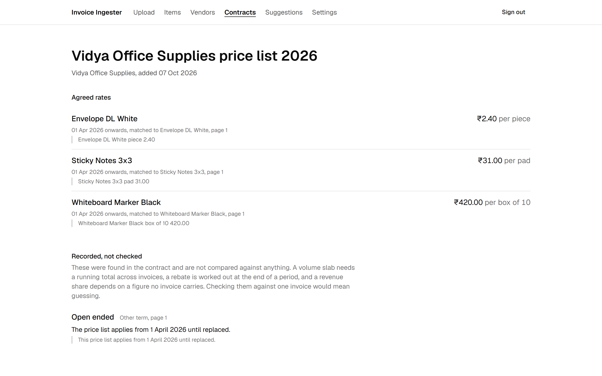
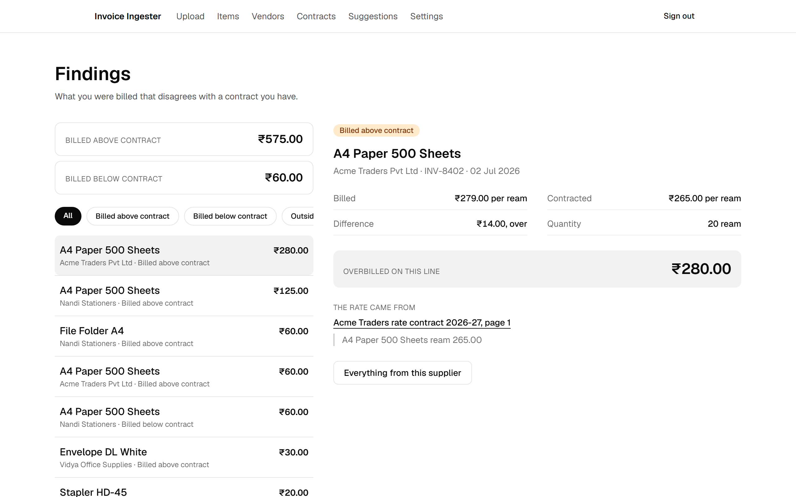
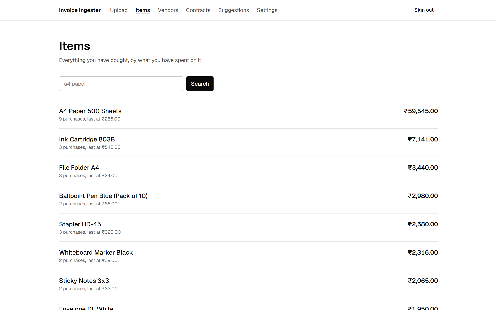
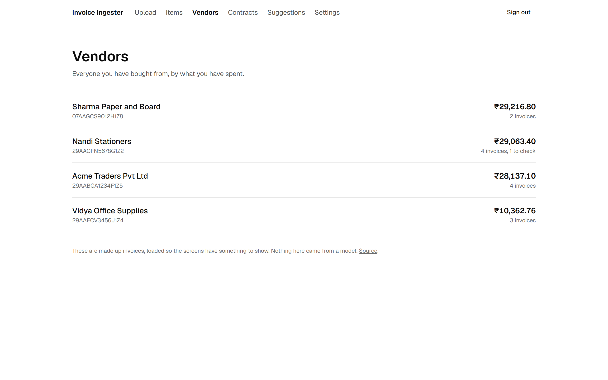
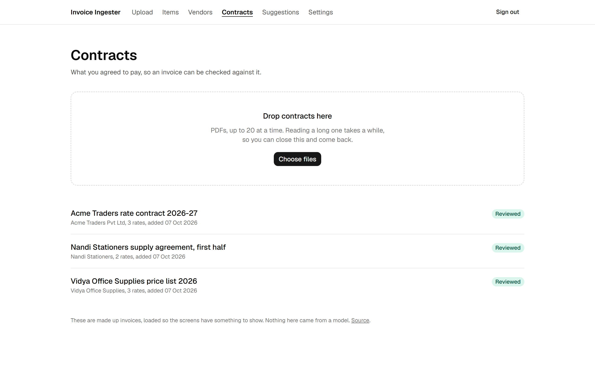
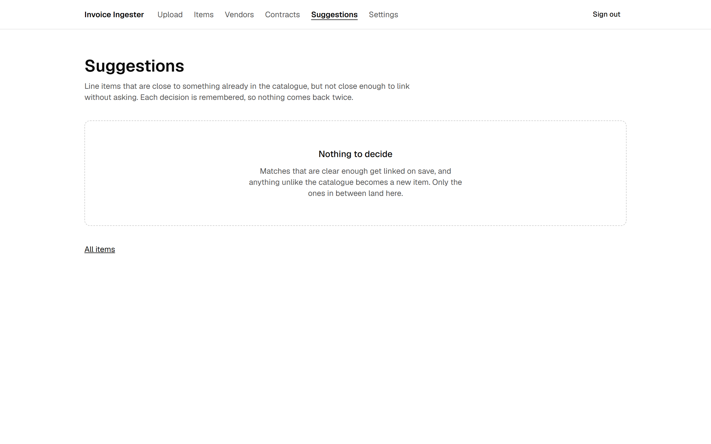

# Invoice Ingester

Drop in the invoices you have already paid and the contracts behind them. It reads both, matches the line items to a catalogue, and tells you where you were billed something other than what you agreed.

**Live:** [invoice-ingester.vercel.app](https://invoice-ingester.vercel.app). The home page is open. The app is behind a password, because it holds real invoices.



## The two questions

Invoices arrive as PDFs and photos, get filed somewhere, and the information in them is never used again. Two questions get hard once there are more than a handful:

1. How much have I paid this vendor in total, and what have I been paying for this item over time?
2. Does any of it disagree with the contract I signed?

Both are answerable from documents you already have. They need the line items extracted, the vendors resolved, the same product recognised across different spellings, and the contract read into dated rates.

## What it looks like

Upload a PDF or a photo. One file can hold several invoices, and a five page PDF of three invoices comes back as three.



An item, with what it has cost over time, the cheapest vendor, and the names a person has taught the matcher.



A contract after review. Every rate carries the page and the words it came from, so a figure can be pointed at rather than taken on trust.



And the point of all of it. One finding, with what was billed, what was agreed, the difference over the quantity on the line, and the sentence in the contract that set the rate.



The rest of the screens: the catalogue, who you buy from, the contracts you have read, and the matches waiting on a person.

| | |
| --- | --- |
|  |  |
|  |  |

Every screenshot here is produced by `npm run screenshots` against the seeded demo. None is captured by hand, because a hand captured image goes stale silently: the screen changes, the picture does not, and the front page starts describing a product that no longer exists. The script refuses to run against a database holding anything other than demo rows, since these are pictures of authenticated screens going into a public repository.

## What it will not do

Worth knowing before you clone it.

- **It will not tell you two prices are comparable when they are not.** Kilograms and grams are converted. A ream against a sheet is refused with the reason, because a ream is 500 sheets of one particular paper rather than 500 of anything.
- **It will not merge two products on a guess.** Descriptions that are close but not clearly the same wait for a person. Measured on real invoices, two different cartridges scored higher than two spellings of one stapler, so no threshold separates them on its own.
- **It will not save an invoice whose own figures disagree** without marking it. It is held for checking rather than folded into a spend total.
- **It will not read a file that is not an invoice.** A photo or a bank statement is declined with a reason rather than turned into a draft of invented fields.
- **It will not compare prices in two currencies.** No exchange rate exists anywhere in the codebase, deliberately. A live rate means a price history that changes shape when the euro moves, and a stored one means a provider, a key and a new class of wrong answer. Rupees and euros are reported separately and said to be incomparable.
- **It will not check a contract term it cannot verify.** Volume slabs, rebates, revenue share and minimum guarantees are read out of the contract, shown with the page and the words they came from, and explicitly not checked. None can be verified against a single invoice.
- **It will not act on a contract nobody has read.** Every rate is inert until a person has confirmed it with the document open beside them. That is what makes reading a two hundred page PDF with a cheap model safe.
- **It is one user with one password.** No accounts, no roles, no tenancy. That was the right call for a first version and it is the first decision to be reversed.

## How it works

**Reading.** A vision model returns structured fields against a fixed schema, through either the Claude API directly or OpenRouter. Both return the same object and both pass through the same validation, so nothing downstream knows which one ran. The OpenRouter model list is built at runtime from the models endpoint, filtered to models that accept images and support structured output, because a hardcoded list of model IDs goes stale and a retired ID does not fail when you pick it, it fails later when you upload.

**Checking the arithmetic.** Line items must sum to the subtotal, and subtotal plus taxes must equal the total. If either fails, the invoice is held for review with the disagreeing figures highlighted rather than saved as though it were fine. Whatever tax the document actually printed is taken, rather than a country being assumed: CGST and SGST, IGST, VAT, sales tax, cess.

**Resolving vendors.** By whatever tax registration the invoice carries, a GSTIN or a VAT number or an EIN, normalised so one registration printed two ways is one supplier. Where there is none, name and address must both agree, because a false merge blends two businesses into one price history and nothing says so.

**Matching items.** Descriptions are normalised and matched against a catalogue using Postgres trigram similarity. Strong matches link on their own, borderline ones wait in a queue, and weak ones become new catalogue entries.

**Reading contracts.** A supply contract becomes dated rates: an item, a unit, a figure, and the period it applies for. An escalation is written out at read time rather than interpreted later, so a rate rising five percent each April becomes three rate rows with three date ranges, and "what was agreed on this date" stays a date lookup.

Reading a two hundred page agreement takes longer than a request stays open, so files go from the browser straight to storage and a queue reads them one at a time. The queue drains itself: each worker hands on to the next before it returns, and a daily sweep hands back anything a function died holding.

The period you confirm on the review screen is stored on the contract. A rate the document gives no date for is kept and takes that period, where it used to be dropped without a word, and a contract with no rate card still covers its dates, so an item it never prices reads as "not in contract" rather than as no contract at all. Contracts reviewed before the period was stored keep being covered by their rate rows, gaps included. A rate the catalogue does not have becomes a new item when you confirm, rather than sitting inert: the review screen says so before it happens, lets you rename it, and offers the close matches first with their scores, so the catalogue does not fill with near duplicates. The contract's name for each item is kept as an alias for the next one. Correcting a rate on a contract that is already live re-checks that supplier's invoices straight away, so a finding is never left standing on the old figure.

On the review screen, clicking a rate moves the document to the page that rate came from. That page is found by searching the document's own text for the quoted line, not taken from the model's word for it. A quote that cannot be found says so, which is a better reason to look closely than any confidence score.

**Then every invoice from that supplier is checked**, including ones saved months earlier. Seven answers, and four of them are right even when a rate was read badly, because they turn on dates, item identity and units rather than on a number.

| Answer | What it means |
| --- | --- |
| `matches contract` | billed what was agreed, within a tolerance you set |
| `billed above contract` | and by how much, over the quantity on the line |
| `billed below contract` | said separately, because it is not leakage and should not read like an accusation |
| `outside contract period` | this supplier has contracts, none covering this invoice date |
| `not in contract` | a contract covers the date and never prices this item |
| `units differ` | agreed by the kilogram, billed by the pack, and no honest way to convert |
| `currency differs` | agreed in one currency and billed in another, which would need an exchange rate for the invoice date |

Four of the seven have no figure, because there is no agreed rate to compare against or no honest way to compare: outside the period, not in the contract, units differ and currency differs. They are listed apart under "Cannot be valued" rather than shown as zero, which would sort them to the bottom as if they were worthless.

Findings are sorted by money, never by count. Seventeen lines billed above contract is not something anyone can act on, and a hundred lines two rupees out would otherwise outrank one line forty thousand out.

## Running it

```
npm install
vercel env pull
npm run migrate
npm run seed
npm run dev
```

`vercel env pull` brings down the Neon connection strings, `ADMIN_PASSWORD`, and `SETTINGS_MASTER_KEY`, the AES-256-GCM key that API keys are sealed with. That key lives in the environment rather than the database, so a database dump on its own opens nothing.

Then open Settings and save a provider key, either an Anthropic one or an OpenRouter one. Nothing can be read out of a document until there is one. Keys are sealed with `SETTINGS_MASTER_KEY` and stored in the database, so they are entered once in the browser rather than kept in a file. For local work there is `ANTHROPIC_API_KEY` and `OPENROUTER_API_KEY` in `.env.local` instead. A saved key always wins over those, and the fallback switches itself off whenever `VERCEL` is set, so a key on your machine can never be spent by the deployment.

`npm run seed` loads the demo: 4 vendors, 9 items, 14 invoices, 33 line items, and 3 contracts whose PDFs the repository generates itself, plus one draft left waiting on the review screen, an image the repository also generates, whose total does not add up. Five of those lines are left to the real matcher rather than seeded as decided: one that links on its own, two near misses that wait in the suggestion queue with the score Postgres gave them, one that becomes a new item, and one that links through an alias somebody taught the matcher, so the queue and the alias mechanism have something to show. Running the real variance check over them produces six of the seven answers above, which is the fastest way to see what the product does. It removes only the rows it seeded, marked with `is_demo`, so it is safe to re-run and doubles as a reset.

```
npm test
```

The Node test runner, no framework. The tests cover the places a mistake would not announce itself: description normalisation, the match thresholds against real Postgres trigram scores, unit conversion, the arithmetic checks, key sealing, the access rules, and what a decision or a merge actually writes. The database backed ones build a throwaway schema from the migration files and drop it afterwards, and skip themselves when there is no database, so the suite still runs on a clean checkout.

[`CONTRIBUTING.md`](CONTRIBUTING.md) has the rest: stacked pull requests, the checks that run before one, migrations, and where secrets live.

## Stack

Next.js App Router on Vercel, Postgres on Neon, Vercel Blob for the original files, and the `pg_trgm` extension for item matching. Originals sit in a private blob store and are served back through an authenticated route, so an uploaded invoice is never on a public URL.

The interface is [shadcn/ui](https://ui.shadcn.com), with components added by the CLI into `components/ui`. Theme tokens, type scale, radius and dark mode are defined once in `app/globals.css`, so screens never define their own colours.

## What it costs to run

Reading an invoice costs about a quarter of a cent with Gemini 2.5 Flash through OpenRouter, or a few cents with Claude directly. The upload screen says what a batch will cost before it starts and what it actually cost afterwards, from the token counts each call reported. Every call is recorded, so settings can show spend for today and this month.

## Where this is

Working end to end: upload, extraction, review, save, item matching, price history, vendor spend, contract ingestion and variance checking. One user, one password, not yet something anyone else can sign up for.

Three documents say what that would take, and each is a decision rather than a task list:

- [`docs/compliance.md`](docs/compliance.md): the two legal roles this product plays, what the DPDP Act and GDPR each require, the subprocessor chain nothing currently discloses, and a retention schedule.
- [`docs/payments.md`](docs/payments.md): who the legal seller is, and everything that follows from the answer. Tax, recurring payment rules, cancellation law, PCI scope.
- [`docs/currency.md`](docs/currency.md): what widening past three currencies touches, and the two bugs found while mapping it.

- [`docs/spec.md`](docs/spec.md) is the specification: scope, data model, architecture, and what is deliberately left out.
- [The plan](https://bharathmay-boop.github.io/invoice-ingester/plan.html) is the same thing with wireframes and flow diagrams, served through GitHub Pages because GitHub shows HTML files in a repository as source.
- [The board](https://github.com/users/bharathmay-boop/projects/1) holds the open issues, grouped into epics by label, including everything above. Counts are left off this page on purpose. The previous version of this README claimed 33 issues and six variance answers, and both had been wrong for months.

Work is tracked on the board, not in these documents. The documents say what is being built and why, and change rarely. The board says what state each piece is in.

## Licence

MIT
